# BE Document

Member(Superviser): @Pham Duc Long (K17 HL)

# Backend Architecture - ManabiHub

## 1. Mục tiêu của backend

Backend của ManabiHub chịu trách nhiệm xử lý toàn bộ nghiệp vụ cốt lõi của hệ thống:

```
Authentication / Authorization
User Profile
Teacher KYC
Course Builder
Course Approval
Learning Progress
AI Writing Assessment
AI Chatbot
Payment
Wallet
Refund
Payout
Admin Moderation
Notification
Audit Log
System Configuration
```

Backend không chỉ là nơi nhận request và trả response. Nó là nơi bảo vệ nghiệp vụ quan trọng như:

```
Ai được phép tạo khóa học
Khóa học nào được publish
Khi nào học viên được học
Khi nào được refund
Khi nào tiền của Teacher được rút
Khi nào AI được phép sử dụng
Admin được phép duyệt hành động nào
```

---

# 2. Công nghệ backend

Backend sử dụng:

```
Java 21
Spring Boot 3.x
Maven
PostgreSQL
Flyway Migration
Spring Security
Spring Data JPA
Spring Validation
Springdoc OpenAPI / Swagger
Docker Compose
GitHub Actions CI
```

Ý nghĩa:

```
Java 21:
Ngôn ngữ chính của backend.

Spring Boot:
Framework để xây dựng REST API, security, validation, database access.

Maven:
Quản lý dependency, build, test.

PostgreSQL:
Database chính cho hệ thống.

Flyway:
Quản lý lịch sử thay đổi database bằng các file SQL migration.

Docker Compose:
Chạy PostgreSQL local giống nhau trên máy các thành viên.

Spring Security:
Quản lý authentication, authorization, phân quyền Guest, Student, Teacher, System Admin.

Springdoc OpenAPI:
Tự sinh Swagger UI để test API.
```

---

# 3. Kiến trúc backend

Backend dùng mô hình:

```
Modular Monolith + Layered Architecture
```

## 3.1. Modular Monolith là gì?

ManabiHub hiện tại chỉ có **một backend application**, nhưng code được chia thành nhiều module nghiệp vụ riêng:

```
identity
kyc
course
content
learning
ai
payment
wallet
refund
payout
admin
moderation
notification
audit
```

Mỗi module phụ trách một nhóm nghiệp vụ rõ ràng.

Ví dụ:

```
kyc/ chỉ xử lý Teacher KYC
course/ chỉ xử lý khóa học
payment/ chỉ xử lý thanh toán
wallet/ chỉ xử lý ví
ai/ chỉ xử lý AI
```

## 3.2. Vì sao không dùng Microservices?

Nhóm không dùng microservices ở SEP490 vì:

```
1. Thời gian dự án ngắn.
2. Nhóm có 5 thành viên, triển khai microservices sẽ tăng độ phức tạp.
3. Các nghiệp vụ còn phụ thuộc dữ liệu chặt chẽ với nhau.
4. Microservices cần thêm service discovery, API gateway, logging, monitoring, deployment phức tạp.
5. Modular Monolith vẫn đủ để chia việc, dễ code, dễ debug, dễ demo.
```

Sau này nếu hệ thống lớn hơn, có thể tách dần:

```
Payment Service
AI Service
Notification Service
Course Service
```

nhưng hiện tại chưa cần.

# 4. Cấu trúc thư mục backend

Cấu trúc backend hiện tại:

```
backend/
├── pom.xml
├── README.md
├── mvnw
├── mvnw.cmd
├── .mvn/
├── docs/
│   └── api-response-convention.md
├── src/
│   ├── main/
│   │   ├── java/
│   │   │   └── com/
│   │   │       └── manabihub/
│   │   │           ├── ManabiHubApplication.java
│   │   │           ├── common/
│   │   │           ├── security/
│   │   │           ├── identity/
│   │   │           ├── kyc/
│   │   │           ├── course/
│   │   │           ├── content/
│   │   │           ├── finaltest/
│   │   │           ├── learning/
│   │   │           ├── writing/
│   │   │           ├── ai/
│   │   │           ├── marketplace/
│   │   │           ├── order/
│   │   │           ├── payment/
│   │   │           ├── wallet/
│   │   │           ├── refund/
│   │   │           ├── payout/
│   │   │           ├── moderation/
│   │   │           ├── admin/
│   │   │           ├── notification/
│   │   │           ├── audit/
│   │   │           ├── file/
│   │   │           └── systemconfig/
│   │   └── resources/
│   │       ├── application.yml
│   │       ├── application-local.yml
│   │       └── db/
│   │           └── migration/
│   │               └── V001__init_baseline.sql
│   └── test/
│       └── java/
│           └── com/
│               └── manabihub/
│                   └── ManabiHubApplicationTests.java
```

---

# 5. Giải thích từng file/folder quan trọng

## 5.1. `backend/pom.xml`

Đây là file cấu hình Maven của backend.

Nó khai báo:

```
Project name
Java version
Spring Boot version
Dependencies
Build plugin
Test plugin
```

Ví dụ dependency có thể gồm:

```
spring-boot-starter-web
spring-boot-starter-security
spring-boot-starter-validation
spring-boot-starter-data-jpa
postgresql
flyway-core
flyway-database-postgresql
springdoc-openapi
lombok
mapstruct
spring-boot-starter-test
```

Khi thêm thư viện mới cho backend, phải thêm vào `pom.xml`.

Ví dụ khi cần dùng JWT:

```
Thêm dependency JWT vào pom.xml
```

Khi cần dùng AWS S3 hoặc Cloudinary:

```
Thêm dependency SDK tương ứng vào pom.xml
```

Không tự add dependency nếu không cần, vì dependency thừa làm project nặng và khó kiểm soát.

---

## 5.2. `backend/README.md`

File hướng dẫn chạy backend.

Nên có:

```
Yêu cầu cài đặt
Cách chạy database local
Cách chạy backend local
Cách chạy test
Cách xem Swagger
Cách kiểm tra Flyway
Cách dùng Maven Wrapper
```

Ví dụ command:

```
cd backend
mvn clean test
mvn spring-boot:run -Dspring-boot.run.profiles=local
```

Hoặc:

```
cd backend
.\mvnw.cmd clean test
.\mvnw.cmd spring-boot:run -Dspring-boot.run.profiles=local
```

---

## 5.3. `backend/mvnw` và `backend/mvnw.cmd`

Đây là Maven Wrapper.

Ý nghĩa:

```
mvnw: dùng cho Linux/Mac/GitHub Actions
mvnw.cmd: dùng cho Windows
```

Maven Wrapper giúp team chạy Maven mà không cần cài Maven global.

Ví dụ trên Windows:

```
cd backend
.\mvnw.cmd clean test
```

Trên GitHub Actions/Linux:

```
cd backend
./mvnw clean test
```

File này **được phép commit**.

---

## 5.4. `backend/.mvn/`

Thư mục cấu hình Maven Wrapper.

Bên trong thường có:

```
.mvn/wrapper/maven-wrapper.properties
```

File này quy định Maven Wrapper sẽ dùng version Maven nào.

Không xóa thư mục này.

---

## 5.5. `backend/docs/api-response-convention.md`

Tài liệu chuẩn response API.

Mục đích:

```
Giúp backend trả response thống nhất
Giúp frontend xử lý success/error dễ hơn
Giúp messageCode thống nhất với MSG trong SRS
```

Ví dụ response thành công:

```
{
  "success": true,
  "messageCode": "COMMON_SUCCESS",
  "message": "Success",
  "data": {},
  "errors": null,
  "timestamp": "2026-06-25T10:00:00",
  "path": "/api/example"
}
```

Ví dụ response lỗi validation:

```
{
  "success": false,
  "messageCode": "VALIDATION_FAILED",
  "message": "Validation failed",
  "data": null,
  "errors": {
    "email": "Email is required",
    "password": "Password must be at least 8 characters"
  },
  "timestamp": "2026-06-25T10:00:00",
  "path": "/api/auth/login"
}
```

Frontend không nên parse raw message. Frontend nên dựa vào:

```
messageCode
```

để map sang text tiếng Việt.

---

# 6. Entry point backend

## 6.1. `ManabiHubApplication.java`

Đây là file khởi động backend Spring Boot.

Vị trí:

```
backend/src/main/java/com/manabihub/ManabiHubApplication.java
```

Nội dung chính:

```
@SpringBootApplication
public class ManabiHubApplication {
    public static void main(String[] args) {
        SpringApplication.run(ManabiHubApplication.class, args);
    }
}
```

Ý nghĩa:

```
Khi chạy backend, Java bắt đầu từ class này.
Spring Boot sẽ scan toàn bộ package com.manabihub.
Các controller, service, repository, config được Spring quản lý từ đây.
```

Không viết logic nghiệp vụ trong file này.

---

# 7. Package `common/`

Package `common/` chứa những thứ dùng chung toàn backend.

```
common/
├── constants/
├── response/
├── exception/
└── demo/
```

---

## 7.1. `common/constants/MessageCodes.java`

File này chứa danh sách message code chuẩn.

Ví dụ:

```
public final class MessageCodes {
    public static final String COMMON_SUCCESS = "COMMON_SUCCESS";
    public static final String VALIDATION_FAILED = "VALIDATION_FAILED";
    public static final String AUTH_UNAUTHORIZED = "AUTH_UNAUTHORIZED";
    public static final String KYC_NOT_APPROVED = "KYC_NOT_APPROVED";
    public static final String COURSE_NOT_FOUND = "COURSE_NOT_FOUND";
}
```

Mục đích:

```
Không hard-code messageCode rải rác trong code.
Tránh gõ sai messageCode.
Giúp frontend biết danh sách code cần map.
Giúp SRS MSG trace được với backend.
```

Quy tắc đặt tên:

```
AUTH_xxx
PROFILE_xxx
KYC_xxx
COURSE_xxx
CONTENT_xxx
FINAL_TEST_xxx
LEARNING_xxx
AI_xxx
PAYMENT_xxx
WALLET_xxx
REFUND_xxx
PAYOUT_xxx
ADMIN_xxx
NOTIFICATION_xxx
SYSTEM_xxx
VALIDATION_xxx
COMMON_xxx
```

---

## 7.2. `common/response/ApiResponse.java`

File chuẩn hóa response thành công hoặc lỗi có data.

Mục tiêu:

```
Mọi API trả về cùng một format.
Frontend không phải xử lý mỗi API một kiểu.
```

Thông thường gồm:

```
success
messageCode
message
data
errors
timestamp
path
```

Ví dụ dùng:

```
return ApiResponse.success(
    MessageCodes.COMMON_SUCCESS,
    "Success",
    data
);
```

---

## 7.3. `common/response/ErrorResponse.java`

File mô tả lỗi chi tiết.

Có thể dùng cho:

```
Validation error
Business error
Unauthorized error
Forbidden error
System error
```

Ví dụ lỗi validation:

```
{
  "field": "email",
  "message": "Email is required"
}
```

Hoặc dạng map:

```
{
  "email": "Email is required",
  "password": "Password must be at least 8 characters"
}
```

---

## 7.4. `common/exception/BusinessException.java`

Exception dùng cho lỗi nghiệp vụ có kiểm soát.

Ví dụ:

```
Teacher chưa được duyệt KYC nhưng cố tạo khóa học
Student chưa mua khóa học nhưng cố học
Course không còn editable
Refund request không hợp lệ
AI không khả dụng cho course này
```

Không nên dùng `RuntimeException` trực tiếp cho các lỗi nghiệp vụ này.

Ví dụ:

```
throw new BusinessException(
    MessageCodes.KYC_NOT_APPROVED,
    "Teacher KYC is not approved"
);
```

---

## 7.5. `common/exception/GlobalExceptionHandler.java`

File xử lý lỗi tập trung toàn backend.

Nó bắt các lỗi như:

```
BusinessException
MethodArgumentNotValidException
ConstraintViolationException
AccessDeniedException
AuthenticationException
Exception
```

Lợi ích:

```
Controller không phải try/catch lung tung.
Tất cả lỗi trả về cùng format ApiResponse.
Không lộ stack trace cho frontend.
Không lộ thông tin nhạy cảm.
```

Ví dụ khi validation fail, response vẫn đúng chuẩn:

```
{
  "success": false,
  "messageCode": "VALIDATION_FAILED",
  "message": "Validation failed",
  "errors": {
    "title": "Course title is required"
  }
}
```

---

## 7.6. `common/demo/DemoController.java`

Controller demo để kiểm tra format response.

Mục đích:

```
Test ApiResponse
Test BusinessException
Test GlobalExceptionHandler
```

Không chứa nghiệp vụ thật.

Sau này khi hệ thống ổn định có thể xóa hoặc giữ ở dev profile.

---

# 8. Package `security/`

## 8.1. `security/config/SecurityConfig.java`

File cấu hình bảo mật.

Mục tiêu:

```
Khai báo endpoint nào public
Endpoint nào cần login
Endpoint nào cần role Student/Teacher/Admin
Cấu hình OAuth2/JWT sau này
```

Hiện tại ở Iteration 0 mới là skeleton.

Các endpoint thường public:

```
/actuator/health
/swagger-ui/**
/v3/api-docs/**
/api/demo/**
```

Các endpoint nghiệp vụ sau này sẽ cần auth:

```
/api/profile/**
/api/teacher/**
/api/student/**
/api/admin/**
/api/payment/**
```

Quy tắc quan trọng:

```
Public site login bằng Google OAuth.
Admin portal không dùng Google OAuth public.
Admin login tách riêng.
```

---

# 9. Các package nghiệp vụ

## 9.1. `identity/`

Phụ trách:

```
User
Role
Student profile
Teacher profile
Google OAuth public login
Admin login
RBAC foundation
```

Các UC liên quan:

```
UC-01 Complete Student Profile Setup
UC-02 Login to Public Site with Google
UC-03 Login to Admin Portal
UC-04 Manage Profile
```

Khi implement, cấu trúc nên là:

```
identity/
├── controller/
├── service/
├── repository/
├── entity/
├── dto/
├── mapper/
└── enums/
```

---

## 9.2. `kyc/`

Phụ trách Teacher KYC:

```
Submit CCCD
Submit FaceID / selfie
Submit JLPT / professional certificate
Submit copyright agreement
Mock VNPT eKYC result
Mock National ID Registry result
Mock JLPT Registry result
Admin KYC review
KYC status transition
```

Các UC:

```
UC-22 Submit KYC Documents
UC-28 Review Teacher KYC
```

Các status có thể có:

```
DRAFT
PENDING_REVIEW
APPROVED
REJECTED
CORRECTION_REQUIRED
```

---

## 9.3. `course/`

Phụ trách khóa học ở mức metadata:

```
Course title
Introduction
JLPT level
Category
Price
Thumbnail
Learning goals
Prerequisites
Target students
Course status
Teacher ownership
Publish status
```

Các UC:

```
UC-23 Create Course Metadata and Learning Goals
UC-25 Submit Course for Review
UC-29 Approve Course Publication
```

---

## 9.4. `content/`

Phụ trách nội dung bên trong khóa học:

```
Module
Lesson
Lesson block
Video block
Text block
Quiz block
Flashcard block
Writing block
```

Quan hệ nghiệp vụ:

```
Course
→ Module
→ Lesson
→ Lesson Block
```

---

## 9.5. `finaltest/`

Phụ trách Final Test cuối khóa.

Final Test là một phần của khóa học.

Nó bao gồm:

```
Question
Answer key
Explanation
Passing score
Time limit
Retake policy
JLPT level
Skill focus
```

Quy tắc:

```
Student chỉ được làm Final Test khi đủ điều kiện học tập.
Final Test pass là một điều kiện để cấp certificate.
```

---

## 9.6. `learning/`

Phụ trách quá trình học:

```
Enrollment
LearningProgress
Lesson completion
Quiz result
Flashcard progress
Final Test eligibility
Certificate eligibility
```

Quy tắc:

```
Student không thể học nếu chưa có Enrollment.
Enrollment chỉ được tạo sau khi backend xác nhận thanh toán thành công.
```

---

## 9.7. `writing/`

Phụ trách bài viết:

```
WritingAssignment
WritingSubmission
WritingFeedback
Revision
Resubmit
Teacher override
```

Dùng chung với module `ai/`.

---

## 9.8. `ai/`

Phụ trách:

```
AI writing assessment
AI chatbot
AI usage log
AI credit/quota
AI eligibility check
AI failure handling
```

Quy tắc nghiệp vụ:

```
AI chỉ khả dụng với khóa học được hỗ trợ AI.
Khóa học free hoặc dưới mức giá sàn AI thì không có AI chatbot/writing assessment.
Student phải enrolled course mới dùng được AI.
AI response phải giới hạn theo ngữ cảnh khóa học/bài học.
```

---

## 9.9. `marketplace/`

Phụ trách phần public/student marketplace:

```
Search courses
View course detail
Course catalog
Course display filtering
Rating/review display
```

---

## 9.10. `order/`

Phụ trách đơn hàng:

```
Create order
Order status
Order amount
Course purchase
Order ownership
```

Order không đồng nghĩa với thanh toán thành công.

---

## 9.11. `payment/`

Phụ trách thanh toán:

```
Payment request
Payment transaction
Payment gateway webhook
Webhook signature verification
Idempotency
Payment status
```

Quy tắc rất quan trọng:

```
Không cấp quyền học chỉ vì frontend báo thanh toán thành công.
Chỉ cấp Enrollment sau khi backend nhận webhook hợp lệ từ Payment Gateway.
```

---

## 9.12. `wallet/`

Phụ trách ví:

```
Student wallet
Teacher wallet
Balance
Ledger
Available balance
Pending balance
Frozen balance
```

Màn hình có thể gọi chung là:

```
My Wallet
```

nhưng backend phải phân quyền action theo role.

---

## 9.13. `refund/`

Phụ trách refund:

```
Refund request
Auto refund eligibility
Manual dispute
Refund decision
Refund transaction
Refund status
```

Quy tắc refund ví dụ:

```
Trong 14 ngày
Progress <= 20%
Chưa consume protected material quá mức
Không có duplicate refund request
```

---

## 9.14. `payout/`

Phụ trách rút tiền teacher:

```
Withdrawal request
Payout settlement
Reconciliation
Payout decision
Payout transaction result
```

Teacher chỉ rút được:

```
Available balance
```

Không được rút:

```
Pending escrow
Frozen balance
Disputed amount
```

---

## 9.15. `moderation/`

Phụ trách báo cáo vi phạm:

```
Violation report
Review evidence
Moderation decision
Force draft
Remove content
Ban user
Freeze balance
```

Các hành động nặng phải audit log.

---

## 9.16. `admin/`

Phụ trách admin portal:

```
Admin dashboard
KYC review
Course approval
Refund review
Payout review
Violation moderation
User management
System settings
Audit log viewer
```

Admin portal tách khỏi public site.

---

## 9.17. `notification/`

Phụ trách thông báo:

```
Create notification
List notifications
Mark as read
Notify KYC result
Notify course approval result
Notify purchase success
Notify refund status
Notify payout status
Notify certificate available
```

---

## 9.18. `audit/`

Phụ trách audit log:

```
Actor
Action
Target object
Before value
After value
Timestamp
IP/device nếu cần
```

Các nghiệp vụ cần audit:

```
Admin approve/reject KYC
Admin approve/reject course
Admin approve/reject refund
Admin execute payout
Admin ban user
Admin freeze balance
System configuration change
```

---

## 9.19. `file/`

Phụ trách file upload:

```
KYC documents
Course thumbnail
Course video
Certificate file
Evidence file
```

Ban đầu có thể lưu local/mock. Sau này có thể chuyển sang cloud storage.

---

## 9.20. `systemconfig/`

Phụ trách cấu hình hệ thống:

```
Commission rate
Course price floor
AI support price floor
Refund window days
Refund progress limit
Escrow holding days
Payout threshold
Validation thresholds
Security settings
```

---

# 10. Resources config

## 10.1. `application.yml`

File cấu hình mặc định.

Dùng cho config chung không phụ thuộc môi trường.

Ví dụ:

```
spring:
  application:
    name: manabihub
```

Không nên đặt password thật trong file này.

---

## 10.2. `application-local.yml`

File cấu hình local development.

Dùng khi chạy:

```
mvn spring-boot:run -Dspring-boot.run.profiles=local
```

Nội dung thường có:

```
spring:
  datasource:
    url: jdbc:postgresql://localhost:5433/manabihub
    username: manabihub
    password: manabihub_dev_password

  flyway:
    enabled: true
    locations: classpath:db/migration
    baseline-on-migrate: true
    validate-on-migrate: true
```

Nếu Docker map port `5432:5432`, datasource dùng port `5432`.

Nếu Docker map port `5433:5432`, datasource dùng port `5433`.

---

# 11. SQL, PostgreSQL, Docker và Flyway

## 11.1. PostgreSQL dùng để làm gì?

PostgreSQL là database chính lưu dữ liệu:

```
Users
Roles
KYCRequest
Course
CourseContent
FinalTest
Enrollment
LearningProgress
AIUsage
Orders
PaymentTransaction
EscrowLedger
TeacherWallet
RefundRequest
WithdrawalRequest
PayoutSettlement
ViolationReport
ModerationDecision
Notification
AuditLog
SystemConfiguration
Wishlist
Review
```

---

## 11.2. Docker Compose dùng để làm gì?

Docker Compose giúp cả team chạy cùng một PostgreSQL local mà không cần cài PostgreSQL thủ công.

File:

```
deploy/docker-compose.local.yml
```

Ví dụ service:

```
services:
  postgres:
    image: postgres:16-alpine
    container_name: manabihub-postgres
    restart: unless-stopped
    ports:
      - "5433:5432"
    environment:
      POSTGRES_DB: manabihub
      POSTGRES_USER: manabihub
      POSTGRES_PASSWORD: manabihub_dev_password
    volumes:
      - manabihub_postgres_data:/var/lib/postgresql/data
```

Ý nghĩa:

```
image:
Image PostgreSQL sẽ chạy.

container_name:
Tên container trong Docker.

ports:
Map port từ máy host vào container.
Ví dụ "5433:5432" nghĩa là máy mình connect port 5433, bên trong container vẫn là 5432.

environment:
Tạo database, user, password khi container khởi tạo lần đầu.

volumes:
Lưu dữ liệu database để khi restart container không mất data.
```

---

## 11.3. Lệnh Docker thường dùng

Start database:

```
docker compose -f deploy/docker-compose.local.yml up -d
```

Stop database:

```
docker compose -f deploy/docker-compose.local.yml down
```

Reset sạch database:

```
docker compose -f deploy/docker-compose.local.yml down -v
docker compose -f deploy/docker-compose.local.yml up -d
```

Kiểm tra container:

```
docker ps
```

Vào psql trong container:

```
docker exec -it manabihub-postgres psql -U manabihub -d manabihub
```

Thoát psql:

```
\q
```

---

## 11.4. Vì sao đôi khi đổi password vẫn bị sai?

PostgreSQL chỉ đọc `POSTGRES_USER`, `POSTGRES_PASSWORD`, `POSTGRES_DB` khi volume được tạo lần đầu.

Nếu volume cũ còn tồn tại, đổi password trong docker-compose không có tác dụng.

Cách xử lý:

```
docker compose -f deploy/docker-compose.local.yml down -v
docker compose -f deploy/docker-compose.local.yml up -d
```

Lệnh `down -v` xóa volume database local.

---

## 11.5. Flyway Migration là gì?

Flyway là công cụ quản lý thay đổi database bằng file SQL versioned.

Thay vì mỗi người tự tạo bảng thủ công trên máy, team sẽ tạo migration file trong code.

Ví dụ:

```
V001__init_baseline.sql
V002__create_identity_tables.sql
V003__create_kyc_tables.sql
V004__create_course_tables.sql
```

Khi backend chạy, Flyway tự kiểm tra file nào chưa chạy và apply vào database.

---

## 11.6. File migration nằm ở đâu?

```
backend/src/main/resources/db/migration/
```

Hiện tại có:

```
V001__init_baseline.sql
```

---

## 11.7. Quy tắc đặt tên migration

Format:

```
V<number>__<description>.sql
```

Lưu ý có **hai dấu gạch dưới** giữa version và description.

Đúng:

```
V001__init_baseline.sql
V002__create_identity_tables.sql
V003__create_kyc_tables.sql
```

Sai:

```
V001_init_baseline.sql
V1-create-user.sql
create_user.sql
```

---

## 11.8. Quy tắc quan trọng nhất của migration

Khi migration đã merge vào `develop`, **không sửa file cũ**.

Sai:

```
Sửa V001__init_baseline.sql sau khi đã merge
Sửa V002__create_identity_tables.sql sau khi team đã pull
```

Đúng:

```
Tạo migration mới:
V003__alter_identity_add_status.sql
V004__add_kyc_rejection_reason.sql
```

Lý do:

```
Flyway lưu checksum của migration đã chạy.
Nếu sửa file cũ, Flyway phát hiện checksum mismatch và backend start lỗi.
```

---

## 11.9. Bảng `flyway_schema_history`

Khi Flyway chạy lần đầu, nó tạo bảng:

```
flyway_schema_history
```

Bảng này lưu:

```
Migration version
Migration name
Checksum
Executed time
Success/failure
```

Nếu thấy bảng này trong DB nghĩa là Flyway đã hoạt động.

---

## 11.10. Check DB trong IDE

Connection:

```
Host: 127.0.0.1
Port: 5433 hoặc 5432 tùy docker-compose
Database: manabihub
Username: manabihub
Password: manabihub_dev_password
```

Sau khi backend chạy local profile, refresh schema `public`, sẽ thấy:

```
Tables
└── flyway_schema_history
```

---

# 12. Backend coding convention

## 12.1. Cấu trúc module khi code thật

Mỗi module nên có:

```
controller/
service/
repository/
entity/
dto/
mapper/
enums/
```

Ví dụ `kyc/`:

```
kyc/
├── controller/
│   └── KycController.java
├── service/
│   ├── KycService.java
│   └── impl/
│       └── KycServiceImpl.java
├── repository/
│   └── KycRequestRepository.java
├── entity/
│   └── KycRequest.java
├── dto/
│   ├── request/
│   │   └── SubmitKycRequest.java
│   └── response/
│       └── KycRequestResponse.java
├── mapper/
│   └── KycMapper.java
└── enums/
    └── KycStatus.java
```

---

## 12.2. Controller

Controller chỉ nên:

```
Nhận request
Validate request
Gọi service
Trả ApiResponse
```

Không viết nghiệp vụ phức tạp trong controller.

---

## 12.3. Service

Service xử lý nghiệp vụ:

```
Check quyền
Check trạng thái
Check business rules
Gọi repository
Gọi external provider/mock provider
Tạo notification
Ghi audit log
```

---

## 12.4. Repository

Repository thao tác database.

Ví dụ:

```
public interface KycRequestRepository extends JpaRepository<KycRequest, UUID> {
}
```

Không viết nghiệp vụ trong repository.

---

## 12.5. Entity

Entity mapping với bảng DB.

Ví dụ:

```
@Entity
@Table(name = "kyc_requests")
public class KycRequest {
}
```

Entity không nên trả thẳng ra frontend. Nên convert sang DTO.

---

## 12.6. DTO

DTO dùng cho request/response.

Ví dụ:

```
SubmitKycRequest
KycRequestResponse
CourseDetailResponse
CreateCourseRequest
```

Không dùng entity làm request body hoặc response body.

---

## 12.7. Mapper

Mapper chuyển đổi:

```
Entity → Response DTO
Request DTO → Entity
```

Có thể dùng MapStruct.

---

# 13. Những file không được commit

Không commit:

```
backend/target/
*.dumpstream
*.log
.env
.env.local
```

Được commit:

```
backend/mvnw
backend/mvnw.cmd
backend/.mvn/
backend/src/main/resources/db/migration/*.sql
backend/README.md
backend/docs/*.md
```

---

# 14. Backend commands

Chạy test:

```
cd backend
mvn clean test
```

Chạy backend local:

```
cd backend
mvn spring-boot:run -Dspring-boot.run.profiles=local
```

Dùng wrapper:

```
cd backend
.\mvnw.cmd clean test
.\mvnw.cmd spring-boot:run -Dspring-boot.run.profiles=local
```

Chạy database:

```
docker compose -f deploy/docker-compose.local.yml up -d
```

Reset database:

```
docker compose -f deploy/docker-compose.local.yml down -v
docker compose -f deploy/docker-compose.local.yml up -d
```

---

# 15. Nguyên tắc backend cho team

```
1. Không code trực tiếp trên develop/main.
2. Mỗi Jira issue có một feature branch.
3. Không sửa module không thuộc task của mình.
4. Không trả response tùy tiện, phải dùng ApiResponse.
5. Không throw RuntimeException bừa bãi, dùng BusinessException cho lỗi nghiệp vụ.
6. Không sửa migration cũ đã merge.
7. Không commit target/ hoặc file build output.
8. Không commit password/token thật.
9. Trước khi PR phải chạy mvn clean test.
10. CI xanh mới merge.
```

[manabihub_erd_mermaid.md](manabihub_erd_mermaid.md)

```mermaid
erDiagram
    APP_USERS ||--o{ USER_ROLES : has
    ROLES ||--o{ USER_ROLES : assigned
    APP_USERS ||--o{ OAUTH_ACCOUNTS : links
    APP_USERS ||--|| USER_PROFILES : owns
    APP_USERS ||--o| TEACHER_PROFILES : owns
    APP_USERS ||--o| ADMIN_CREDENTIALS : owns

    APP_USERS ||--o{ FILES : uploads
    APP_USERS ||--o{ KYC_APPLICATIONS : submits
    KYC_APPLICATIONS ||--o{ KYC_DOCUMENTS : contains
    FILES ||--o{ KYC_DOCUMENTS : attached

    APP_USERS ||--o{ COURSES : teaches
    COURSES ||--o{ COURSE_MODULES : has
    COURSE_MODULES ||--o{ LESSONS : has
    LESSONS ||--o{ LESSON_BLOCKS : has
    LESSON_BLOCKS ||--o| QUIZZES : configures
    QUIZZES ||--o{ QUIZ_QUESTIONS : has
    QUIZ_QUESTIONS ||--o{ QUIZ_CHOICES : has
    LESSON_BLOCKS ||--o| FLASHCARD_SETS : configures
    FLASHCARD_SETS ||--o{ FLASHCARDS : has
    COURSES ||--o| FINAL_TESTS : has
    FINAL_TESTS ||--o{ FINAL_TEST_QUESTIONS : has
    FINAL_TEST_QUESTIONS ||--o{ FINAL_TEST_CHOICES : has

    APP_USERS ||--o{ WISHLISTS : saves
    COURSES ||--o{ WISHLISTS : saved
    APP_USERS ||--o{ ORDERS : places
    COURSES ||--o{ ORDERS : purchased
    ORDERS ||--o{ PAYMENT_TRANSACTIONS : paid_by
    APP_USERS ||--o{ ENROLLMENTS : studies
    COURSES ||--o{ ENROLLMENTS : enrolled
    ORDERS ||--o| ENROLLMENTS : grants_access

    ENROLLMENTS ||--o{ LESSON_PROGRESS : tracks
    LESSONS ||--o{ LESSON_PROGRESS : completed_by
    ENROLLMENTS ||--o{ QUIZ_ATTEMPTS : attempts
    QUIZZES ||--o{ QUIZ_ATTEMPTS : quiz_attempt
    FINAL_TESTS ||--o{ QUIZ_ATTEMPTS : final_attempt
    LESSON_BLOCKS ||--o| WRITING_ASSIGNMENTS : configures
    WRITING_ASSIGNMENTS ||--o{ WRITING_SUBMISSIONS : receives
    ENROLLMENTS ||--o{ WRITING_SUBMISSIONS : submits
    WRITING_SUBMISSIONS ||--o{ WRITING_FEEDBACK : receives
    APP_USERS ||--o{ AI_REQUESTS : makes
    COURSES ||--o{ AI_REQUESTS : contextualizes
    ENROLLMENTS ||--o| CERTIFICATES : earns

    COURSES ||--o{ COURSE_REVIEWS : reviewed
    APP_USERS ||--o{ COURSE_REVIEWS : writes
    APP_USERS ||--o{ VIOLATION_REPORTS : reports
    VIOLATION_REPORTS ||--o{ MODERATION_ACTIONS : resolved_by
    APP_USERS ||--o{ NOTIFICATIONS : receives
    APP_USERS ||--o{ AUDIT_LOGS : performs

    APP_USERS ||--|| WALLETS : owns
    WALLETS ||--o{ WALLET_TRANSACTIONS : records
    ORDERS ||--o| ESCROW_LEDGER : creates
    APP_USERS ||--o{ ESCROW_LEDGER : teacher_share
    ORDERS ||--o{ REFUND_REQUESTS : refunded_by
    APP_USERS ||--o{ REFUND_REQUESTS : requests
    APP_USERS ||--o{ WITHDRAWAL_REQUESTS : withdraws
    WALLETS ||--o{ WITHDRAWAL_REQUESTS : debits
    WITHDRAWAL_REQUESTS ||--o| PAYOUT_SETTLEMENTS : settled_by
```

